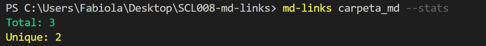
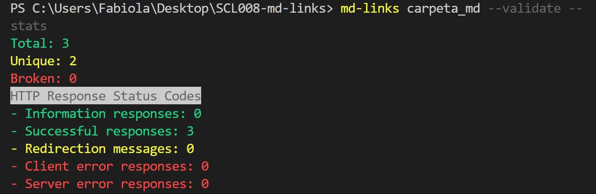

# faog-md-links

Extrae los links de tus directorios y/o archivos markdown (.md), valida su status y obten algunos datos estadísticos.

## Diagrama de Flujo

## Instalación

```
npm install faog-md-links
```

## Guía de uso
```js
const md-links = require ( 'faog-md-links' ) ;   
```

**CLI (Command Line Interface - Interfaz de Línea de Comando)**

Puedes ejecutar esta librería de la siguiente forma:

* Leer archivos con extensión .md

`md-links <path-to-file.md>`

```
$ md-links example.md
example.md http://algo.com/2/3/ Link a algo
example.md https://otra-cosa.net/algun-doc.html algún doc
```

ejemplo:


* Leer un directorio

`md-links <path-to-directory>`

```
$ md-links ./some/example.md
./some/example.md http://algo.com/2/3/ Link a algo
./some/example.md https://otra-cosa.net/algun-doc.html algún doc
```
ejemplo:


En ambos casos, se obtiene como resultado:

- `file`: archivo o ruta donde fue encontrado el link.
- `href`: link encontrado.
- `text`: descripción del link.

**Options**

-- validate

Al usar esta opción podrás averiguar el status y texto del link validado.

```
$ md-links ./some/example.md --validate
./some/example.md http://algo.com/2/3/ ok 200 Link a algo
./some/example.md https://otra-cosa.net/algun-doc.html fail 404 algún doc
```
ejemplo:


--stats

Esta opción permite obtener como salida un texto con los links totales (Total) y si son unicos (Unique).

```
$ md-links ./some/example.md --stats
Total: 2
Unique: 2
```
ejemplo:



--validate --stats
Si combinas ambas opciones, podrás obtener aquellos links rotos (Broken) y un conteo de los códigos de estado de respuesta HTTP, que indican si se ha completado satisfactoriamente una solicitud HTTP específica.

```
$ md-links ./some/example.md --stats
Total: 2
Unique: 2
Broken: 1
HTTP Response Status Codes
- Information responses: 0
- Successful responses: 1
- Redirection messages: 0
- Client error responses: 1
- Server error responses: 0
```
ejemplo:




## Documentación técnica


## Autor

Fabiola Orellana
