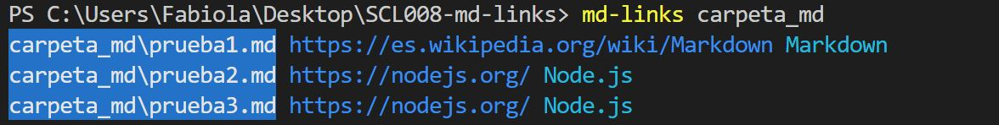
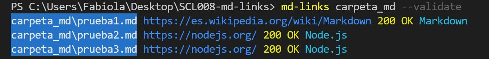

# faog-md-links

<a href="https://nodei.co/npm/faog-md-links/"></a>

Extrae los links de tus directorios y/o archivos markdown (.md), valida su status y obten algunos datos estadísticos.

## Instalación

```
npm install faog-md-links
```

## Guía de uso
```js
const md-links = require ( 'faog-md-links' ) ;   
```

**CLI (Command Line Interface - Interfaz de Línea de Comando)**

Puedes ejecutar esta librería de la siguiente forma:

* Leer archivos con extensión .md

`md-links <path-to-file.md>`

```
$ md-links example.md
example.md http://algo.com/2/3/ Link a algo
example.md https://otra-cosa.net/algun-doc.html algún doc
```
ejemplo:


* Leer un directorio

`md-links <path-to-directory>`

```
$ md-links ./some/example.md
./some/example.md http://algo.com/2/3/ Link a algo
./some/example.md https://otra-cosa.net/algun-doc.html algún doc
```
ejemplo:



En ambos casos, se obtiene como resultado:

- `file`: archivo o ruta donde fue encontrado el link.
- `href`: link encontrado.
- `text`: descripción del link.

**Options**

-- validate

Al usar esta opción podrás averiguar el status y texto del link validado.

```
$ md-links ./some/example.md --validate
./some/example.md http://algo.com/2/3/ ok 200 Link a algo
./some/example.md https://otra-cosa.net/algun-doc.html fail 404 algún doc
```
ejemplo:



--stats

Esta opción permite obtener como salida un texto con los links totales (Total) y si son unicos (Unique).

```
$ md-links ./some/example.md --stats
Total: 2
Unique: 2
```
ejemplo:


--validate --stats

Si combinas ambas opciones, podrás obtener aquellos links rotos (Broken) y un conteo de los códigos de estado de respuesta HTTP, que indican si se ha completado satisfactoriamente una solicitud HTTP específica.

```
$ md-links ./some/example.md --stats
Total: 2
Unique: 2
Broken: 1
HTTP Response Status Codes
- Information responses: 0
- Successful responses: 1
- Redirection messages: 0
- Client error responses: 1
- Server error responses: 0
```
ejemplo:


## Documentación técnica

### Dependencias:

- node.js versión 11 o mejor (probado en node.js 11.8)
- node-fetch: 2.3.0+
- jest: 24.7.1+ (para ejecutar los test) 
- chalk: 2.4.2+,
- filehound: 1.17.0+,
- marked: 0.6.2+

### Funciones implementadas:

```js
1.- (Promise)mdLinks(path,options)
```
Retorna una promesa con un arreglo que contiene los links encontrados en ```path```, según las opciones especificadas en 
```options```.

*Parámetros*

- ```path:``` Ruta a un archivo .md (markup) o una carpeta conteniendo archivos .md

- ```options:``` objeto conteniendo las siguientes opciones:

*validate:(true)* Si es especificado, se intentará validar si el link es válido o no (accediendolo a través de internet), y se incluirá el status de la conexión y su respectivo statusText.
	
- ```Retorno:``` 
Promesa que al resolverse retorna el siguiente arreglo:
```
[
	{
		href:<ruta del link>,
		text:<texto del link>,
		file:<ubicación del archivo que contiene este link>,
		(opcional) status:<código http del status>,
		(opcional) statusText:<texto que representa el status>
	},...
]
```

```js
2.- (Promise)extractLinksFromFile(path)
```
Retorna una promesa con los links de un archivo .md. Esta función es interna y usa un renderer de [Marked](https://www.npmjs.com/package/marked),.

```js
3.- (Promise)validateLink(link)
```
Valida el status de un link.

*Parámetros*

- (Object) link: {href: ```ruta del link```}

- ```Retorno```: Promesa que al resolverse retorna el siguiente objeto:
```
{	
	href:<ruta del link>,
	status:<código http del status>,
	statusText:<texto que representa el status>
}
```	

```js
4.- (Object)statLinks(links,options)
```
Retorna un objeto de estadisticas varias acerca de una lista de links.

*Parámetros*
```
links: 
[
	{
		link: {href:<ruta del link>,
		status:<código http del status>,
		statusText:<texto que representa el status>
	},...
]
```
- ```options:``` objeto conteniendo las siguientes opciones:

*validate:(true):* Si es especificado se incluirá en las estadísticas la cantidad de links rotos.
	
- ```Retorno:```
```
{
	linksTotal:<Total de links en los archivos>,
	linksUnique:<Total de links unicos en los archivos>,
	(opcional) linksBroken:<Total de links rotos, con status 0 (fallo de conexión), o mayores o iguales a 400>
}
```
```js
5.- (String[]) extractMDFromDirectory(path)
```

Retorna un arreglo de los archivos .md presentes en un directorio. Esta función es interna y usa fileHound para retornar dicho arreglo.

```js
6.- (Object) responseStatusCodesHTTP(responseStats, links)
```
Retorna una clasificación de los códigos de error http. Esta función es interna y es usada por CLI para mostrar los códigos específicos.


## Autor

Fabiola Orellana
